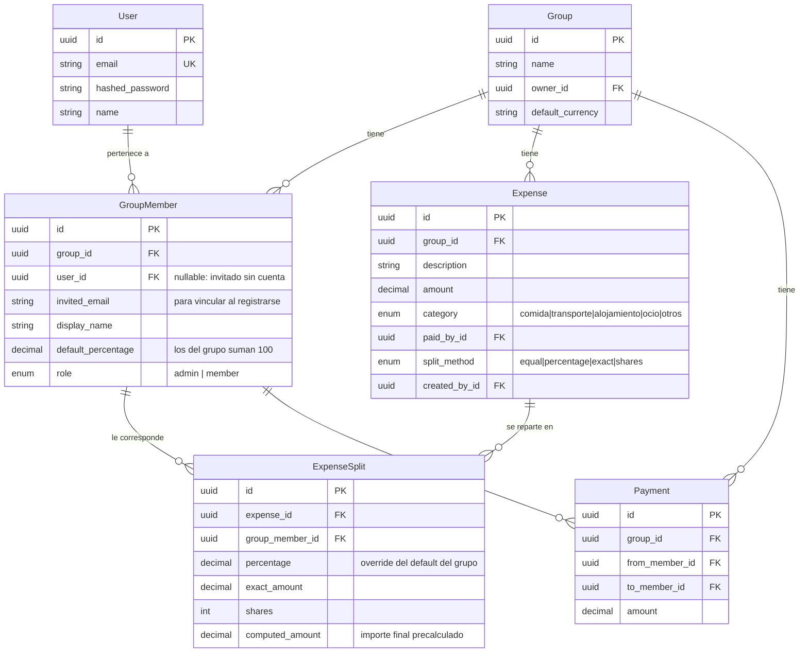

# 💸 Dividi

API REST de gastos compartidos tipo **Tricount/Splitwise** construida con FastAPI: grupos de gastos, 4 métodos de división (incluyendo porcentajes por persona configurables a nivel de grupo con override por gasto), balances netos, **simplificación automática de deudas** y registro por invitación.

**Stack:** Python 3.12 · FastAPI · PostgreSQL · SQLAlchemy 2.0 · Pydantic v2 · Alembic · JWT · pytest · Docker

---

## 🚀 Levantar el proyecto en 2 comandos

```bash
cp .env.example .env
docker-compose up --build
```

API en `http://localhost:8000` — Swagger UI en `http://localhost:8000/docs`.

Sin Docker (necesita un PostgreSQL local, o solo para los tests):

```bash
python3.12 -m venv .venv && source .venv/bin/activate
pip install -r requirements.txt
alembic upgrade head        # aplica migraciones (requiere DATABASE_URL)
uvicorn app.main:app --reload
```

## 🧪 Tests

```bash
pytest
```

86 tests (unitarios de la lógica de negocio + integración de la API completa). Corren sobre **SQLite en memoria** — sin dependencias externas, suite en segundos. La lógica más delicada tiene tests exhaustivos dedicados:

- `test_split_calculator.py` — los 4 métodos de división, redondeos, porcentajes que no suman 100, participantes duplicados, importes de 1 céntimo...
- `test_debt_simplifier.py` — deudas circulares, grupos saldados, residuos de redondeo, verificación de que las transacciones sugeridas realmente saldan todos los balances.
- `test_invitations.py` — bootstrap del fundador, códigos de un solo uso, invitaciones atadas a email, caducidad y revocación.

## 📐 Modelo de datos



## ➗ Los 4 métodos de división

Ejemplo: gasto de **100 €** en un grupo de 3 (Ana, Bea, Carlos).

| Método | Entrada | Resultado |
|---|---|---|
| `equal` | — | 33.33 / 33.33 / **33.34** |
| `percentage` | 50 / 30 / 20 (o los % por defecto del grupo) | 50 / 30 / 20 |
| `exact` | 70 / 20 / 10 (debe sumar el total) | 70 / 20 / 10 |
| `shares` | 2 / 1 / 1 partes | 50 / 25 / 25 |

**Porcentajes en dos niveles**: cada miembro tiene un `default_percentage` en el grupo (validado: siempre suman 100). Un gasto `percentage` sin `splits` explícitos usa esos defaults; con `splits` se hace override solo para ese gasto (validado: suman 100).

**Regla de redondeo**: cada parte se redondea a 2 decimales (`ROUND_HALF_UP`) y **el último participante de la lista absorbe la diferencia**, de modo que la suma de las partes siempre es exactamente el importe del gasto. Ej.: 10 € entre 3 → 3.33 + 3.33 + 3.34.

## ⚖️ Balances y simplificación de deudas

### Balance neto por miembro

```
balance = (gastos adelantados) − (parte que le corresponde de cada gasto)
        + (pagos realizados)   − (pagos recibidos)
```

Positivo → le deben dinero. Negativo → debe dinero. La suma de todos los balances de un grupo es siempre 0 (invariante verificado por tests).

> Nota de diseño: un *pago realizado* suma al balance (es dinero aportado, igual que adelantar un gasto) y un *pago recibido* resta. Con los signos al revés, pagar una deuda la duplicaría en lugar de saldarla.

### Algoritmo de settle-up (`GET /groups/{id}/settle-up`)

Es el **minimum cash flow problem**: dado el balance neto de cada miembro, encontrar el mínimo de transacciones que salda el grupo. Hallar el mínimo absoluto es NP-hard (equivale a particionar los balances en el máximo número de subconjuntos que suman 0), así que se usa un **greedy** clásico:

1. Separar deudores (balance < 0) y acreedores (balance > 0) en dos *max-heaps*.
2. Emparejar el mayor deudor con el mayor acreedor: transacción de `min(|deuda|, crédito)`.
3. Reinsertar el resto que quede pendiente y repetir hasta vaciar los heaps (margen de redondeo: 0.01 €).

Garantiza como máximo **n−1 transacciones** y corre en **O(n log n)** por las operaciones de heap.

**Ejemplo numérico** — cena de 90 € pagada por Ana, a partes iguales entre 3:

| Miembro | Balance |
|---|---|
| Ana | +60 |
| Bea | −30 |
| Carlos | −30 |

Settle-up sugiere 2 transacciones: `Bea → Ana: 30 €` y `Carlos → Ana: 30 €`. Sin simplificación, un histórico largo de gastos cruzados puede requerir muchas más.

## 🔑 API

| Método | Ruta | Descripción |
|---|---|---|
| POST | `/auth/register` | Alta con código de invitación (el primer usuario, fundador, no lo necesita) |
| POST | `/auth/login` | Login (OAuth2 password flow) → JWT access + refresh |
| POST | `/auth/refresh` | Renovar tokens |
| POST / GET | `/invitations` | Generar invitaciones de acceso / listar las mías |
| GET | `/invitations/{code}/check` | Validar un código (público, para el formulario de registro) |
| DELETE | `/invitations/{id}` | Revocar una invitación no usada |
| POST / GET | `/groups` | Crear grupo (creador = admin, 100%) / listar los míos |
| GET / PATCH / DELETE | `/groups/{id}` | Detalle con miembros / editar / borrar (solo admin) |
| POST | `/groups/{id}/members` | Añadir miembro por email o invitado sin cuenta |
| PATCH / DELETE | `/groups/{id}/members/{mid}` | Editar % (con `rebalance`) / eliminar |
| POST / GET | `/groups/{id}/expenses` | Crear gasto / listar con filtros `category`, `date_from`, `date_to` |
| GET / PATCH / DELETE | `/groups/{id}/expenses/{eid}` | Detalle / editar (recalcula splits) / borrar |
| GET | `/groups/{id}/balances` | Balance neto de cada miembro |
| GET | `/groups/{id}/settle-up` | Transacciones sugeridas para saldar el grupo |
| POST / GET | `/groups/{id}/payments` | Registrar / listar pagos entre miembros |

**Permisos**: solo el `admin` puede gestionar el grupo/miembros y editar/borrar gastos de otros; un `member` solo los suyos. Cualquier miembro consulta balances y registra gastos/pagos.

**Rebalance de porcentajes**: como los `default_percentage` deben sumar 100 siempre, las operaciones sobre miembros aceptan un campo `rebalance` (`{member_id: nuevo_%}`) para ajustar al resto en la misma transacción atómica:

```json
POST /groups/{id}/members
{ "email": "bea@example.com", "default_percentage": 30, "rebalance": {"<id_ana>": 70} }
```

**Invitados sin cuenta**: se añade un miembro solo con `display_name` o con un `email` aún no registrado. Cuando esa persona se registra con ese email, su cuenta se vincula automáticamente a todas sus memberships pendientes.

## 🧠 Decisiones técnicas

- **PostgreSQL y no SQLite** en producción: tipos `NUMERIC` reales para dinero, concurrencia, `UUID` nativo. SQLite solo en tests por velocidad y cero setup (SQLAlchemy abstrae la diferencia).
- **`Decimal` en toda la cadena** (SQLAlchemy `Numeric` + Pydantic `Decimal`): jamás floats para dinero.
- **`computed_amount` precalculado** en cada split: el reparto se calcula una vez al escribir (y se revalida al editar), no en cada lectura de balances.
- **JWT stateless** (access 30 min + refresh 7 días) en lugar de sesiones: sin estado en servidor, escala horizontal trivial, estándar para APIs.
- **Greedy y no flujo mínimo óptimo** en settle-up: el óptimo absoluto es NP-hard; el greedy da ≤ n−1 transacciones en O(n log n) y es el mismo enfoque que usan las apps reales.
- **Validación de invariantes en el service layer** (porcentajes suman 100, exact suma el total) con excepciones de dominio (`SplitValidationError`) traducidas a HTTP 400 en el router.
- **Alembic desde el día 1**: el esquema evoluciona con migraciones versionadas, no con `create_all`.

## 📂 Estructura

```
app/
├── main.py               # FastAPI app + routers
├── config.py             # settings desde variables de entorno
├── database.py           # engine, sesión, Base
├── security.py           # bcrypt + JWT
├── dependencies.py       # get_current_user, permisos de grupo
├── models/               # SQLAlchemy: User, Group, GroupMember, Expense, ExpenseSplit, Payment
├── schemas/              # Pydantic v2: request/response
├── routers/              # auth, groups (+balances/settle-up), expenses, payments
└── services/
    ├── split_calculator.py   # los 4 métodos de división + redondeo
    ├── debt_simplifier.py    # greedy del minimum cash flow
    └── balance_service.py    # balance neto por miembro
alembic/                  # migraciones
tests/                    # 86 tests: unitarios + integración end-to-end
```

## 🗺️ Roadmap (Fase 3)

- Exportación PDF/CSV del resumen de grupo
- Subida de imagen de recibo (`receipt_image_url` ya previsto en el modelo)
- Invitación por enlace/email
- Multi-divisa por grupo
