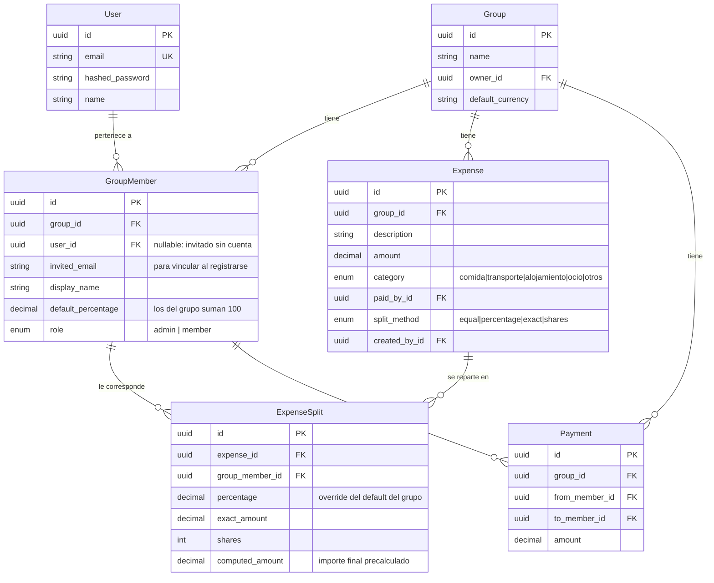

# Dividi

API REST de gastos compartidos tipo **Tricount/Splitwise** construida con FastAPI: grupos de gastos, 4 métodos de división (incluyendo porcentajes por persona configurables a nivel de grupo con override por gasto), balances netos, **simplificación automática de deudas** y registro por invitación.

**Stack:** Python 3.12 · FastAPI · PostgreSQL · SQLAlchemy 2.0 · Pydantic v2 · Alembic · JWT · pytest · Docker

---

## Puesta en marcha

```bash
cp .env.example .env
docker compose up --build
```

API en `http://localhost:8000` — Swagger UI en `http://localhost:8000/docs`.

### Guardia de secretos

Antes de trabajar sobre el repositorio, instala el hook que impide commitear una credencial:

```bash
brew install gitleaks pre-commit
pre-commit install
```

A partir de ahí, cada `git commit` pasa [gitleaks](https://github.com/gitleaks/gitleaks) sobre
lo que hay en el índice. Si encuentra algo con forma de clave, el commit no se crea y el aviso
sale con el valor tapado. Para comprobar que está puesto:

```bash
echo 'SECRET_KEY="8f3c1d9b74a25e60af18c3d5729be4610cd8a37f92b45e08d1c6f2a49b73e5d0"' > prueba.txt  # gitleaks:allow
git add prueba.txt && git commit -m "prueba"   # debe fallar
git restore --staged prueba.txt && rm prueba.txt
```

Para esa comprobación no sirve una credencial de ejemplo sacada de la documentación de un
proveedor: gitleaks las tiene en su lista de permitidas —la clave de AWS que aparece en sus
manuales lleva `EXAMPLE` dentro— y el commit pasaría, haciendo creer que el hook no está.

Un valor de pruebas que salte sin serlo se marca en su propia línea con un comentario
`gitleaks:allow`. La verificación del lado del servidor —*push protection* y escaneo de
secretos de GitHub— está activada en el repositorio y **no depende de este hook**: el hook
avisa antes de escribir el commit, que es cuando arreglarlo todavía es gratis.

Sin Docker (necesita un PostgreSQL local, o solo para los tests):

```bash
python3.12 -m venv .venv && source .venv/bin/activate
pip install -r requirements.txt
alembic upgrade head        # aplica migraciones (con MIGRATION_DATABASE_URL en DATABASE_URL)
uvicorn app.main:app --reload
```

## Tests

```bash
pytest
```

86 tests (unitarios de la lógica de negocio + integración de la API completa). Corren sobre **SQLite en memoria** — sin dependencias externas, suite en segundos. La lógica más delicada tiene tests exhaustivos dedicados:

- `test_split_calculator.py` — los 4 métodos de división, redondeos, porcentajes que no suman 100, participantes duplicados, importes de 1 céntimo...
- `test_debt_simplifier.py` — deudas circulares, grupos saldados, residuos de redondeo, verificación de que las transacciones sugeridas realmente saldan todos los balances.
- `test_invitations.py` — bootstrap del fundador, códigos de un solo uso, invitaciones atadas a email, caducidad y revocación.

## Modelo de datos


```mermaid
erDiagram
    User ||--o{ GroupMember : "pertenece a"
    Group ||--o{ GroupMember : "tiene"
    Group ||--o{ Expense : "tiene"
    Group ||--o{ Payment : "tiene"
    Expense ||--o{ ExpenseSplit : "se reparte en"
    GroupMember ||--o{ ExpenseSplit : "le corresponde"
    GroupMember ||--o{ Payment : "paga / recibe"

    User {
        uuid id PK
        string email UK
        string hashed_password
        string name
    }
    Group {
        uuid id PK
        string name
        uuid owner_id FK
        string default_currency
    }
    GroupMember {
        uuid id PK
        uuid group_id FK
        uuid user_id FK "nullable: invitado sin cuenta"
        string invited_email "para vincular al registrarse"
        string display_name
        decimal default_percentage "los del grupo suman 100"
        enum role "admin | member"
    }
    Expense {
        uuid id PK
        uuid group_id FK
        string description
        decimal amount
        enum category "comida|transporte|alojamiento|ocio|otros"
        uuid paid_by_id FK
        enum split_method "equal|percentage|exact|shares"
        uuid created_by_id FK
    }
    ExpenseSplit {
        uuid id PK
        uuid expense_id FK
        uuid group_member_id FK
        decimal percentage "override del default del grupo"
        decimal exact_amount
        int shares
        decimal computed_amount "importe final precalculado"
    }
    Payment {
        uuid id PK
        uuid group_id FK
        uuid from_member_id FK
        uuid to_member_id FK
        decimal amount
    }
```

## Métodos de división

Ejemplo: gasto de **100 €** en un grupo de 3 (Ana, Bea, Carlos).

| Método | Entrada | Resultado |
|---|---|---|
| `equal` | — | 33.33 / 33.33 / **33.34** |
| `percentage` | 50 / 30 / 20 (o los % por defecto del grupo) | 50 / 30 / 20 |
| `exact` | 70 / 20 / 10 (debe sumar el total) | 70 / 20 / 10 |
| `shares` | 2 / 1 / 1 partes | 50 / 25 / 25 |

**Porcentajes en dos niveles**: cada miembro tiene un `default_percentage` en el grupo (validado: siempre suman 100). Un gasto `percentage` sin `splits` explícitos usa esos defaults; con `splits` se hace override solo para ese gasto (validado: suman 100).

**Regla de redondeo**: cada parte se redondea a 2 decimales (`ROUND_HALF_UP`) y **el último participante de la lista absorbe la diferencia**, de modo que la suma de las partes siempre es exactamente el importe del gasto. Ej.: 10 € entre 3 → 3.33 + 3.33 + 3.34.

## Balances y simplificación de deudas

### Balance neto por miembro

```
balance = (gastos adelantados) − (parte que le corresponde de cada gasto)
        + (pagos realizados)   − (pagos recibidos)
```

Positivo → le deben dinero. Negativo → debe dinero. La suma de todos los balances de un grupo es siempre 0 (invariante verificado por tests).

> Nota de diseño: un *pago realizado* suma al balance (es dinero aportado, igual que adelantar un gasto) y un *pago recibido* resta. Con los signos al revés, pagar una deuda la duplicaría en lugar de saldarla.

### Algoritmo de settle-up (`GET /groups/{id}/settle-up`)

Es el **minimum cash flow problem**: dado el balance neto de cada miembro, encontrar el mínimo de transacciones que salda el grupo. Hallar el mínimo absoluto es NP-hard (equivale a particionar los balances en el máximo número de subconjuntos que suman 0), así que se usa un **greedy** clásico:

1. Separar deudores (balance < 0) y acreedores (balance > 0) en dos *max-heaps*.
2. Emparejar el mayor deudor con el mayor acreedor: transacción de `min(|deuda|, crédito)`.
3. Reinsertar el resto que quede pendiente y repetir hasta vaciar los heaps (margen de redondeo: 0.01 €).

Garantiza como máximo **n−1 transacciones** y corre en **O(n log n)** por las operaciones de heap.

**Ejemplo numérico** — cena de 90 € pagada por Ana, a partes iguales entre 3:

| Miembro | Balance |
|---|---|
| Ana | +60 |
| Bea | −30 |
| Carlos | −30 |

Settle-up sugiere 2 transacciones: `Bea → Ana: 30 €` y `Carlos → Ana: 30 €`. Sin simplificación, un histórico largo de gastos cruzados puede requerir muchas más.

## API

| Método | Ruta | Descripción |
|---|---|---|
| POST | `/auth/register` | Alta con código de invitación (el primer usuario, fundador, no lo necesita) |
| POST | `/auth/login` | Login (OAuth2 password flow) → JWT access + refresh |
| POST | `/auth/refresh` | Renovar tokens |
| POST / GET | `/invitations` | Generar invitaciones de acceso / listar las mías |
| GET | `/invitations/{code}/check` | Validar un código (público, para el formulario de registro) |
| DELETE | `/invitations/{id}` | Revocar una invitación no usada |
| POST / GET | `/groups` | Crear grupo (creador = admin, 100%) / listar los míos |
| GET / PATCH / DELETE | `/groups/{id}` | Detalle con miembros / editar / borrar (solo admin) |
| POST | `/groups/{id}/members` | Añadir miembro por email o invitado sin cuenta |
| PATCH / DELETE | `/groups/{id}/members/{mid}` | Editar % (con `rebalance`) / eliminar |
| POST / GET | `/groups/{id}/expenses` | Crear gasto / listar con filtros `category`, `date_from`, `date_to` |
| GET / PATCH / DELETE | `/groups/{id}/expenses/{eid}` | Detalle / editar (recalcula splits) / borrar |
| GET | `/groups/{id}/balances` | Balance neto de cada miembro |
| GET | `/groups/{id}/settle-up` | Transacciones sugeridas para saldar el grupo |
| POST / GET | `/groups/{id}/payments` | Registrar / listar pagos entre miembros |
| GET | `/me/export` | Copia de los datos personales de la cuenta (RGPD art. 15 y 20) |
| DELETE | `/me` | Borrado de la cuenta, con la contraseña como confirmación (RGPD art. 17) |

**Permisos**: solo el `admin` puede gestionar el grupo/miembros y editar/borrar gastos de otros; un `member` solo los suyos. Cualquier miembro consulta balances y registra gastos/pagos.

**Rebalance de porcentajes**: como los `default_percentage` deben sumar 100 siempre, las operaciones sobre miembros aceptan un campo `rebalance` (`{member_id: nuevo_%}`) para ajustar al resto en la misma transacción atómica:

```json
POST /groups/{id}/members
{ "email": "bea@example.com", "default_percentage": 30, "rebalance": {"<id_ana>": 70} }
```

**Invitados sin cuenta**: se añade un miembro solo con `display_name` o con un `email` aún no registrado. Cuando esa persona se registra con ese email, su cuenta se vincula automáticamente a todas sus memberships pendientes.

## Decisiones técnicas

- **PostgreSQL y no SQLite** en producción: tipos `NUMERIC` reales para dinero, concurrencia, `UUID` nativo. SQLite solo en tests por velocidad y cero setup (SQLAlchemy abstrae la diferencia).
- **`Decimal` en toda la cadena** (SQLAlchemy `Numeric` + Pydantic `Decimal`): jamás floats para dinero.
- **`computed_amount` precalculado** en cada split: el reparto se calcula una vez al escribir (y se revalida al editar), no en cada lectura de balances.
- **JWT stateless** (access 30 min + refresh 7 días) en lugar de sesiones: sin estado en servidor, escala horizontal trivial, estándar para APIs.
- **Greedy y no flujo mínimo óptimo** en settle-up: el óptimo absoluto es NP-hard; el greedy da ≤ n−1 transacciones en O(n log n) y es el mismo enfoque que usan las apps reales.
- **Validación de invariantes en el service layer** (porcentajes suman 100, exact suma el total) con excepciones de dominio (`SplitValidationError`) traducidas a HTTP 400 en el router.
- **Alembic desde el día 1**: el esquema evoluciona con migraciones versionadas, no con `create_all`.

## Estructura

```
app/
├── main.py               # FastAPI app + routers
├── config.py             # settings desde variables de entorno
├── database.py           # engine, sesión, Base
├── security.py           # bcrypt + JWT
├── dependencies.py       # get_current_user, permisos de grupo
├── models/               # SQLAlchemy: User, Group, GroupMember, Expense, ExpenseSplit, Payment, Invitation
├── schemas/              # Pydantic v2: request/response
├── routers/              # auth, invitations, groups (+balances/settle-up), expenses, payments
└── services/
    ├── split_calculator.py   # los 4 métodos de división + redondeo
    ├── debt_simplifier.py    # greedy del minimum cash flow
    ├── balance_service.py    # balance neto por miembro
    └── invitation_service.py # códigos de acceso invite-only
alembic/                  # migraciones
tests/                    # 86 tests: unitarios + integración end-to-end
```

## Datos personales (RGPD)

La aplicación trata datos de personas en la UE, así que lleva registro de qué trata y por qué,
y permite ejercer los derechos de acceso, portabilidad y supresión sin que nadie toque la base
de datos a mano.

### Registro de actividades de tratamiento (art. 30)

| Tratamiento | Datos | Base legal (art. 6) | Conservación |
|---|---|---|---|
| Cuenta de usuario | Email, nombre, hash de la contraseña, fecha de alta | Ejecución del contrato (6.1.b) | Mientras la cuenta exista; se borra a petición |
| Gastos y balances de grupo | Descripción, importe, categoría, fecha, reparto, quién pagó | Ejecución del contrato (6.1.b) | Mientras el grupo exista; sobrevive al borrado de un miembro, anonimizado |
| Fotos de tiques | Imagen del tique; los metadatos EXIF se eliminan antes de guardarla (`receipts.py`) | Ejecución del contrato (6.1.b) | Mientras exista el gasto |
| Gastos personales, nómina y ahorro | Importes declarados por la persona, solo visibles para ella | Ejecución del contrato (6.1.b) | Mientras la cuenta exista; se borra por completo al borrarla |
| Amistades y notificaciones | Relación entre cuentas, avisos recibidos | Ejecución del contrato (6.1.b) | Mientras la cuenta exista; se borra por completo al borrarla |
| Registro de seguridad | IP, momento, ruta, id de usuario, tipo de evento | Interés legítimo en la seguridad (6.1.f) | Rotación de los ficheros de log |
| Freno de fuerza bruta | Huella SHA-256 del email e intentos fallidos | Interés legítimo en la seguridad (6.1.f) | Se poda en cada login correcto |

**Responsable**: la persona que opera la instancia. **Encargados**: Hostinger (alojamiento de la
VPS) y Cloudflare (proxy y TLS). No hay transferencias fuera del EEE más allá de las que cubran
esos dos proveedores en sus propias condiciones.

### Derecho de acceso y portabilidad (art. 15 y 20)

`GET /me/export` devuelve, en JSON, el perfil, las finanzas personales, los gastos personales,
los planes de ahorro, las amistades y, de cada grupo, los gastos y pagos que le afectan con su
parte calculada. De los demás miembros solo aparece el nombre que usan **dentro del grupo**,
porque sin él los importes no se entienden; nunca su email ni nada de su vida privada.

### Derecho de supresión (art. 17)

`DELETE /me`, con la contraseña como confirmación. La fila del usuario no se puede eliminar:
los gastos de un grupo compartido apuntan a ella y son también datos de los demás miembros,
cuyos balances quedarían descuadrados (art. 17.3). Lo que hace el borrado:

- **se lleva lo que solo era suyo**: gastos personales, nómina, presupuestos, planes de ahorro,
  notificaciones, amistades y todas las sesiones abiertas;
- **desvincula sus miembros de grupo**: pasan a llamarse «Usuario eliminado», sin cuenta y sin
  email de invitación, conservando los importes;
- **vacía su email de la invitación que canjeó**, que su invitador ve en `GET /invitations`.
  La fila se queda y el código sigue consumido: `validate_code` corta en `is_used` antes de
  mirar el email. Las invitaciones que esa persona **creó** para otros no se tocan, porque ahí
  el email reserva el código y borrarlo lo abriría a cualquiera;
- **deja una lápida** en `users`: sin email real, sin nombre, con una contraseña que nadie puede
  acertar y marcada con `deleted_at`, que rechazan tanto `get_current_user` como `/auth/login`.

El email queda libre para volver a registrarse. Es importante que el borrado vacíe
`group_members.invited_email`: el alta vincula miembros pendientes por esa columna, así que
dejarla puesta metería a quien reutilizase la dirección en los grupos de la persona anterior.

Lo implementa `app/services/borrado_de_cuenta_service.py`, y lo cubre `tests/test_rgpd.py`.

## Copias de seguridad

Copia diaria automática de la base de datos y de las fotos de tiques, cifrada con
[`age`](https://github.com/FiloSottile/age) y con retención 7 diarias / 4 semanales / 6 mensuales.
El servidor solo tiene la clave pública: puede crear copias, no leerlas.

Cada copia guarda además un inventario (conteo exacto de filas por tabla y SHA-256 de cada
tique) que permite verificar una restauración fila a fila y hash a hash.
`scripts/restaurar-prueba.sh` levanta un PostgreSQL vacío en Docker, restaura dentro y compara.

Procedimiento completo y registro de pruebas: **[`docs/restauracion.md`](docs/restauracion.md)**.

## Roadmap

- Exportación PDF/CSV del resumen de grupo
- Subida de imagen de recibo (`receipt_image_url` ya previsto en el modelo)
- Invitación por enlace/email
- Multi-divisa por grupo
